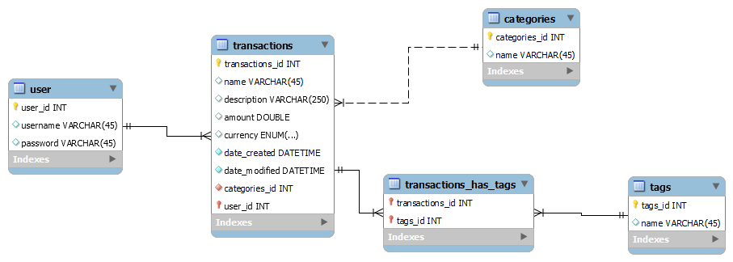

# Overview

The point of this project is to begin practicing database access and CRUD operations from within Python scripts.

The database is essentially a collection of tables for tracking and organizing expenses as an aid for budgeting.

The software queries the database for transactions and performs a join with the categories table in order to aggregate transactions in various groups. There are also tags that can be added which serve as extra descriptors of a given transaction.

[Software Demo Video](https://youtu.be/NJWcc4xArqI)

## Relational Database

I am using MySQL for my database.

## Development Environment

- MySQL Workbench (Local MySQL Server)
- Visual Studio Code
- Python 3
- dotenv-python
- mysql-connector-python

## Useful Websites

- [MySQL](https://dev.mysql.com/doc/connector-python/en/connector-python-example-cursor-select.html)
- [Stack Overflow](https://stackoverflow.com/questions/40216311/reading-in-environment-variables-from-an-environment-file)

## Future Work

{Make a list of things that you need to fix, improve, and add in the future.}

- Add Cash Ammounts to Pie slices in pie charts
- Display data in a popout table rather than in the console
- Implement use of tags for greater aggregation specificity
